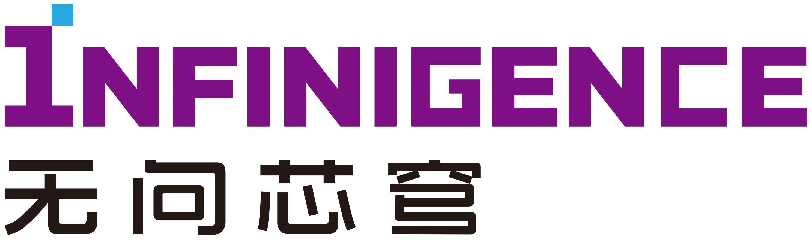
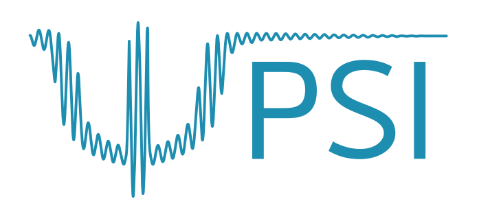

# LCSC 

**[website (on the way)]** **[[paper (ICLR25)]([http://arxiv.org/abs/2404.02241](https://openreview.net/forum?id=QowsEic1sc&noteId=WE08tmA6kY))]** **[[paper (arXiv)](http://arxiv.org/abs/2404.02241)]** **[[code](https://github.com/imagination-research/LCSC)]**

This is the official code of paper "Linear Combination of Saved Checkpoints Makes Consistency and Diffusion Models Better (ICLR25)".

If you find this repository or paper useful, you can cite
```
@misc{liu2024linear,
      title={Linear Combination of Saved Checkpoints Makes Consistency and Diffusion Models Better}, 
      author={Enshu Liu and Junyi Zhu and Zinan Lin and Xuefei Ning and Matthew B. Blaschko and Sergey Yekhanin and Shengen Yan and Guohao Dai and Huazhong Yang and Yu Wang},
      year={2024},
      eprint={2404.02241},
      archivePrefix={arXiv},
      primaryClass={cs.CV}
}
```

## Enhanced Models

We have released some of the model weights enhanced by LCSC. Here are the download links for these model weights:

 * CD on CIFAR-10 at 840K training iteration: https://drive.google.com/file/d/1puC9600dONkBVmeYEljKTcZTtvcnLkwI/view?usp=sharing
 * CT on CIFAR-10 at 830K training iteration: https://drive.google.com/file/d/1mSH3KgNjGv5_DE1bweYqvgZwcMhYzJwp/view?usp=sharing
 * CD on ImageNet-64 at 620K training iteration: https://drive.google.com/file/d/19A9xCcHGpDrTpzL8ey_2F2M2wVTbmReJ/view?usp=sharing
 * CT on ImageNet-64 at 1000K training iteration:  https://drive.google.com/file/d/1sYz1MAfZz6eNWE2zp3fC9zW3famoll6b/view?usp=sharing
 * Improved DDPM on ImageNet-64 at 350K training iteration: https://drive.google.com/file/d/1nQS-e-NNwc_aSKQRahwO5htq9LzaJ4WI/view?usp=drive_link
 * DDPM on CIFAR10 at 800K training iteration: https://drive.google.com/file/d/1tkmbJ85IX9BQK5qGNI26F2vEc7nH-1qf/view?usp=drive_link 

## Dependencies

To install all packages in this codebase along with their dependencies, run
```sh
pip install -e .
```

To install with Docker, run the following commands:
```sh
cd docker && make build && make run
```

## Model training

We recommend using the original codebase to train models and saving checkpoints for LCSC during the training process. In our paper, we use the official code of [consistency models](https://github.com/openai/consistency_models) to conduct experimetns with consistency distillation and consistency training. For diffusion models, we use the official code of [DDIM](https://github.com/ermongroup/ddim) and [iDDPM](https://github.com/openai/improved-diffusion) to train models on CIFAR-10 and ImageNet-64, respectively. 

## Search the combination coefficients

We are still rearranging our code of evolutionary search and will soon release it.

## Model sampling

We provide examples of EDM training, consistency distillation, consistency training, single-step generation, and multistep generation in [scripts/sample.sh](scripts/sample.sh).

## Evaluations

We use FID to compare the different generative models. We implement FID calculation in [evaluations/fid_score.py](evaluations/fid_score.py) based on [Pytorch FID](https://github.com/mseitzer/pytorch-fid). One can also use the implementation from the original Consistency Models codebase in [evaluations/evaluator.py](evaluations/evaluator.py), which may yield results slightly different from the former implementation. Our sample scripts will automatically evaluate the generated samples stored in `.npz` (numpy) files after finishing the sampling process.

## Acknowledgement

This work is a joint work from [NICS-EFC Lab](https://nicsefc.ee.tsinghua.edu.cn/) (Tsinghua University), [Infinigence-AI](https://www.infini-ai.com/) (Beijing, China), [ESAT-PSI lab](https://www.esat.kuleuven.be/psi) (KU Leuven), [Microsoft Research](https://www.microsoft.com/en-us/research/) and [Shanghai Jiao Tong University](https://www.sjtu.edu.cn/). 

<p align="middle">
  
  
  
  
  
</p>

All computational resources used in this work are supported by [Infinigence-AI](https://www.infini-ai.com/).
<p align="middle">
  
</p>

Our search and sampling implementations have been developed based on [Consistency Models](https://github.com/openai/consistency_models), [DDIM](https://github.com/ermongroup/ddim), [DPM-Solver](https://github.com/LuChengTHU/dpm-solver), [Improved DDPM](https://github.com/openai/improved-diffusion). We thank these valuable works.

## Contact Us

* Enshu Liu: les23@mails.tsinghua.edu.cn
* Junyi Zhu: Junyi.zhu@esat.kuleuven.be
* Zinan Lin: zinanlin@microsoft.com
* Xuefei Ning: foxdoraame@gmail.com
* Yu Wang: yu-wang@tsinghua.edu.cn 

